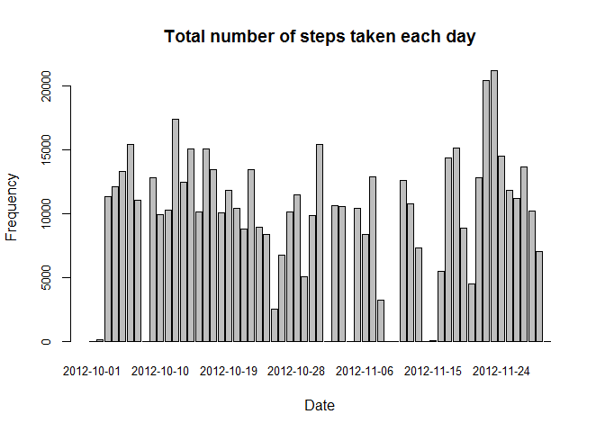
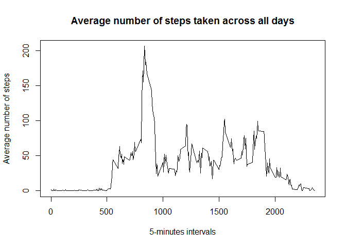
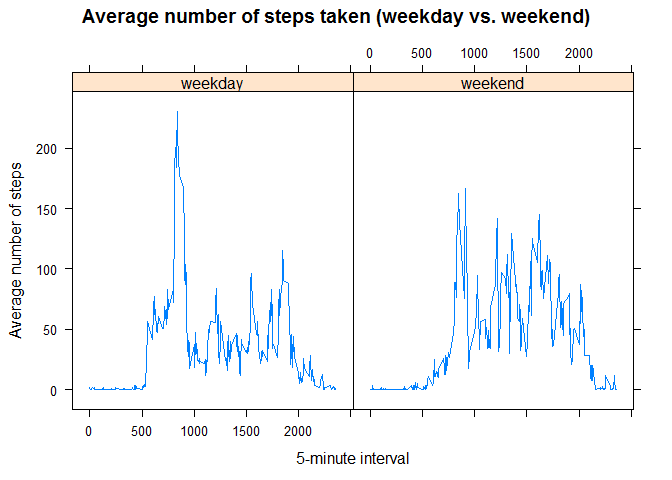

# Reproducible Research: Peer Assessment 1
Jeronimo J Vogt  
18 de outubro de 2015  


## Loading and preprocessing the data

Load input data from a zip file from the current working directory


```r
data <- read.csv(unz("activity.zip", "activity.csv"), header=TRUE, sep=",", stringsAsFactors=FALSE)
```

Create a subset and aggregate total steps by date


```r
library("plyr")
subset <- subset(data, select = c(steps, date))
totalSepsByDate <- ddply(subset, .(date), colwise(sum), na.rm=TRUE)
```

## What is mean total number of steps taken per day?

Make a histogram of the total number of steps taken each day


```r
barplot(totalSepsByDate$steps, names.arg=totalSepsByDate$date, ylab = "Frequency", xlab = "Date", cex.names=0.8, cex.axis=0.8, main = "Total number of steps taken each day")
```

 

Calculate the mean and median total number of steps taken per day


```r
mean <- mean(totalSepsByDate$steps)
median <- median(totalSepsByDate$steps)
```

The mean is *9354*

The median is *10395*

## What is the average daily activity pattern?

Make a time series plot of the 5-minute interval (x-axis) and the average number of steps taken, averaged across all days (y-axis)


```r
subset2 <- subset(data, select = c(steps, interval))
averageByInterval <- ddply(subset2, .(interval), summarise, mean=mean(steps, na.rm=TRUE))
plot(averageByInterval, ylab = "Average number of steps", xlab = "5-minutes intervals", type = "l", main="Average number of steps taken across all days")
```

 

Which 5-minute interval, on average across all the days in the dataset, contains the maximum number of steps?


```r
x <- averageByInterval[with(averageByInterval, order(-mean)), ]
max <- x[x$mean==max(x$mean), ]
```

The max 5-minute interval is *835* and then mean is *206*

## Imputing missing values

Calculate and report the total number of missing values in the dataset


```r
n <- sum(is.na(data$steps))
```

The total number of rows with NAs is *2304*

Devise a strategy for filling in all of the missing values in the dataset. The strategy does not need to be sophisticated. For example, you could use the mean/median for that day, or the mean for that 5-minute interval, etc. Create a new dataset that is equal to the original dataset but with the missing data filled in.


```r
data2 <- merge(data, averageByInterval, by.x = "interval", by.y = "interval", all = TRUE)

data2 <- within(data2, steps <- ifelse(is.na(steps)==TRUE, mean, steps))
```

Make a histogram of the total number of steps taken each day and Calculate and report the mean and median total number of steps taken per day.


```r
subset3 <- subset(data2, select = c(steps, date))
totalStepsByDate2 <- ddply(subset3, .(date), colwise(sum), na.rm=TRUE)
barplot(totalStepsByDate2$steps, names.arg=totalStepsByDate2$date, ylab = "Frequency", xlab = "Date",  cex.names=0.8, cex.axis=0.8, main = "Total number of steps taken each day \n (after imputate NA)")
```

 

```r
mean2 <- mean(totalStepsByDate2$steps)
median2 <- median(totalStepsByDate2$steps)
```

The mean is *10766*

The median is *10766*

**Observations:**

- Do these values differ from the estimates from the first part of the assignment? *It does not differ so much.*
- What is the impact of imputing missing data on the estimates of the total daily number of steps? *I could see that  frequency counts increased as expected. Most statistical packages default to discarding any case that has a missing value which may introduce bias or affect the representativeness of the results.*

## Are there differences in activity patterns between weekdays and weekends?

Create a new factor variable in the dataset with two levels ("weekday" and "weekend") indicating whether a given date is a weekday or weekend day.


```r
Sys.setlocale(locale = "English_United States.1252")
```

```
## [1] "LC_COLLATE=English_United States.1252;LC_CTYPE=English_United States.1252;LC_MONETARY=English_United States.1252;LC_NUMERIC=C;LC_TIME=English_United States.1252"
```

```r
data2$weekday <- as.factor(ifelse(weekdays(as.Date(data2$date)) %in% 
                 c("Saturday","Sunday",""),"weekend", "weekday"))
```

Make a panel plot containing a time series plot (i.e. type = "l") of the 5-minute interval (x-axis) and the average number of steps taken, averaged across all weekday days or weekend days (y-axis).


```r
library("lattice")

subset4 <- subset(data2, select = c(steps, interval, weekday))
averageByWeekday <- ddply(subset4, .(weekday, interval), summarise, mean=mean(steps, na.rm=TRUE))

p <- xyplot(mean ~ interval | factor(weekday), data=averageByWeekday,
       type = 'l',
       main="Average number of steps taken (weekday vs. weekend)",
       xlab="5-minute interval",
       ylab="Average number of steps")
print (p)
```

 
